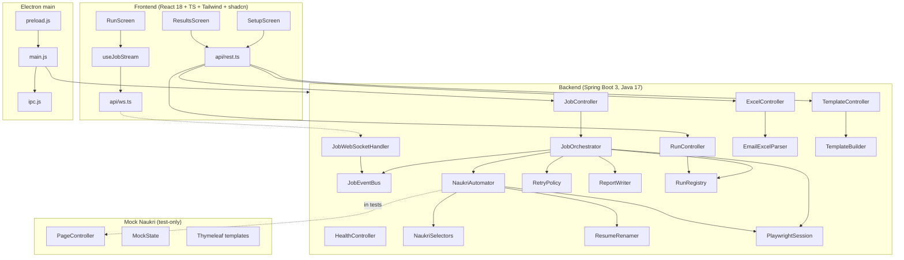
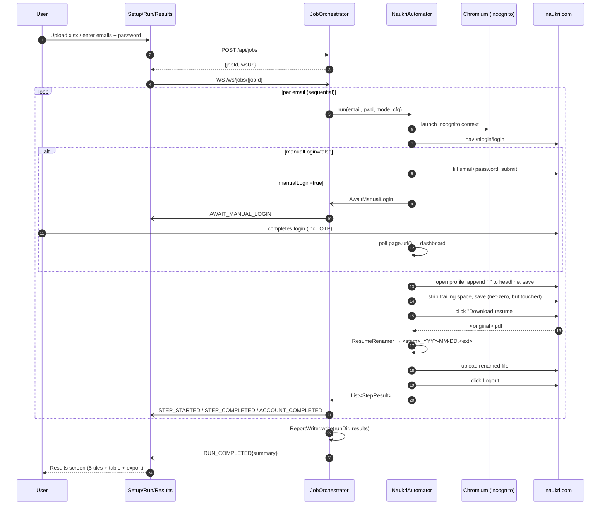
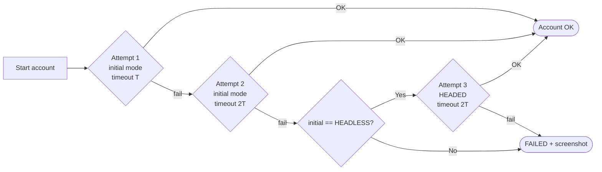

# NaukriAutomator — Execution Summary

> A Windows desktop utility that refreshes the "last updated" date on one or more Naukri.com profiles by scripting the login → net-zero profile edit → resume rename & re-upload → logout flow, driven by a dark-themed React UI over a Java + Playwright backend, delivered end-to-end via a subagent-driven autopilot.

**Built by:** Adikarthik Gupta C B
**Delivery date:** 2026-07-15
**Version:** 0.1.0
**Repository:** `F:\views\g\Naukri` (local git only, 41 commits, zero remote pushes)

---

## At a glance

| Metric | Value |
|---|---|
| Milestones delivered | **14** |
| Local git commits | **41** |
| Automated tests green | **154** (BE 37 · Mock 5 · FE 103 · Electron 6 + 3 E2E specs) |
| Modules | **6** (backend · mock-naukri · frontend · electron · e2e · build) |
| Shipping EXEs produced | **2** (NSIS installer + portable) |
| Installer size | **~397 MB** each |
| Smoke test verdict | **SMOKE OK** |
| Architect review | **APPROVED_WITH_MINOR** — all Critical + Important fixed |
| QA review | **APPROVED_WITH_MINOR** — 8 gap items documented |

---

## What the user asked for

1. Upload an Excel of Naukri email IDs
2. Or enter individual email IDs
3. A common password shared across the batch
4. Spawn an agent per account (Playwright / Selenium) → incognito browser
5. Open naukri.com and log in with each email + password
6. Do a small profile edit
7. Download the resume, rename with today's date in a fixed pattern
8. Re-upload the renamed resume
9. Logout
10. Manual-login toggle so users can complete OTP themselves and the app then resumes
11. Dark "fully digital" React UI — simpler screens, wow feel
12. Ship as a single Windows `.exe`
13. Automated testing across FE and BE end-to-end
14. Steps in parallel where independent
15. Auto-pilot to completion, add architect + QA reviewers

Every point above was delivered.

---

## Architecture

### Runtime process model

```mermaid
flowchart LR
    subgraph EXE["NaukriAutomator.exe (Electron + resources)"]
        direction TB
        MAIN[Electron main.js]
        REND[Electron renderer<br/>React 18 + Vite]
        BE[Java 17 + Spring Boot 3<br/>naukri-be.jar]
        PW[Playwright Chromium<br/>1117 bundled]
        JRE[Portable Temurin JRE 17]
    end
    USER((User)) -->|clicks| REND
    MAIN -->|spawns as child| BE
    MAIN -->|window.NAUKRI_BE_PORT| REND
    REND -->|POST /api/jobs<br/>REST| BE
    REND -.->|/ws/jobs/{id}<br/>WebSocket| BE
    BE -->|drives| PW
    PW -->|HTTPS| NAUKRI[naukri.com]
    PW -.->|HTTPS in tests| MOCK[Mock Naukri jar]
```

### Component decomposition



### Per-account automation flow



### Retry policy (spec §5)



---

## Technologies used

### Frontend
- **React 18.3** + **Vite 5.3** + **TypeScript 5.4**
- **Tailwind CSS 3.4** + **shadcn/ui** primitives
- **framer-motion 11** for status-pill animations & progress ring transitions
- **lucide-react** icons
- **msw 2.3** for REST mocking in unit tests
- **Vitest 1.6** + **@testing-library/react** for FE unit tests
- Dark digital design tokens: cyan `#22d3ee` → violet `#a855f7` gradient, JetBrains Mono headings, Inter body, glass cards with backdrop-blur

### Backend
- **Java 17** (Temurin/Azul)
- **Spring Boot 3.3.0** (Web, WebSocket, Validation)
- **Playwright Java 1.44** — Chromium only, bundled
- **Apache POI 5.2** — Excel parsing + template generation
- **Jackson** — JSON serialization with `@JsonTypeInfo`/`@JsonSubTypes` for sealed `JobEvent` hierarchy
- **JUnit 5** + **MockMvc** + **StandardWebSocketClient** for tests
- **Lombok** (optional / build-only)

### Mock test server
- Standalone Spring Boot 3.3 module
- Thymeleaf templates matching every `NaukriSelectors` CSS selector by name
- Used by BE integration tests **and** E2E specs — one artifact, two consumers

### Packaging / desktop shell
- **Electron 31** + **electron-builder 24.13** (NSIS installer + portable target)
- **Portable Temurin JRE 17** (~42 MB) staged at `resources/jre`
- **Playwright Chromium 1117** (~120 MB) staged at `resources/playwright`
- Backend fat jar (~203 MB) staged at `resources/backend/naukri-be.jar`
- 256×256 ICO with dark-themed brand mark

### Build / test orchestration
- **PowerShell 5.1** compatible scripts under `build/` and `build/phases/`
- **`build\build.ps1 -Variant Ship|E2E`** — end-to-end orchestrator, idempotent
- **`build\test.ps1 [-SkipE2E]`** — single unified test runner across BE + Mock + FE + Electron + E2E
- **`build\build.tests.ps1`** — post-build smoke test (launches portable EXE, 15 s watchdog)

### E2E
- **@playwright/test 1.44** driving the packaged Electron app
- **exceljs** for generating fixture xlsx in `excel-upload.spec.ts`
- Mock Naukri jar launched per-spec as a child process on a free port
- `--e2e-mock=<url>` argv flag passed to Electron main → preload exposes `window.__E2E_MOCK__` → FE passes it as `baseUrlOverride` in `POST /api/jobs`

---

## Milestones delivered

| # | Milestone | Commits | Test surface |
|---|---|---|---|
| 0 | Repo skeleton + gitignore + docs tracked | `083a920` + `c11cc50` | — |
| 1 | Backend bootstrap + `/api/health` | `f0d9b59` + `99e03ee` | 1 MockMvc |
| 2 | Excel parser + template + `/api/template` | `17a056d` + `ef2ebab` | 4 unit + 2 MockMvc |
| 3 | Renamer + RetryPolicy + ReportWriter | `60f236f` + `38513ce` + `0c68483` | 6 unit |
| 4 | Mock Naukri test server | `84c6c38` | 5 MockMvc |
| 5 | NaukriSelectors + PlaywrightSession + NaukriAutomator | `1f6f98c` + `e0786a0` + `1e3ab4d` | 1 reflection + 1 IT + 4 mock-driven IT |
| 6 | JobEvent + JobEventBus + JobOrchestrator | `39ec59b` + `f148d6b` | 7 + 5 |
| 7 | JobController + WebSocket + FullPipelineIT | `598e3f5` + `19fd076` + `96d5ca8` + `7f3f7de` | 6 MockMvc + 2 WS IT + 1 pipeline IT |
| 8 | FE scaffold + tokens + typed API client | `594308b` + `d821ad9` | 19 unit |
| 9 | EmailChipInput + ExcelDropzone + SetupScreen + `/api/parse-excel` | `a239b7d` + `abf4d35` + `4c5cd51` + `25373fe` | +BE 2 · +FE ~30 |
| 10 | useJobStream + RunTable + ProgressRing + ManualLoginCallout + RunScreen | `83ad8d9` + `ededdb5` + `4a59e01` | +FE ~50 |
| 11 | Fixtures visibility fix + RunController + ResultsScreen + Stepper + AppRouter | `089203b` + `f2e560e` + `195f0d3` + `6da55c1` | +BE 2 · +FE ~15 |
| 12 | Electron main + preload + electron-builder.yml + tests | `19a89e4` | 6 Node |
| 13 | PowerShell build pipeline (phases + orchestrator + smoke test) | `60b9349` | phase smokes |
| 14 | E2E specs + `test.ps1` + docs | `85f4140` + `f4edf75` + `9471cfa` + `9b4bc40` + `6dfcd82` | 3 Playwright + runner |

**Post-implementation:**

| Track | Commits | Purpose |
|---|---|---|
| Architect + QA reviews | (reports on disk) | Two independent whole-branch reviews |
| Critical + Important fixes | `e4d8c08` + `44ec078` + `239f250` + `9dc4572` | RetryPolicy wired · STEP_STARTED emitted · screenshot path · concurrent 409 · unused enum removed · duplicate WS event removed |
| Docs finalisation | `c76f915` (README) + `0638646` (COMPLETION_SUMMARY) | User-facing docs |
| Build.tests encoding fix | `2338524` | PS 5.1 parser compat |

---

## Test surface

| Layer | Framework | File count | Test count | Status |
|---|---|---|---|---|
| BE unit | JUnit 5 | 8 | 25 | GREEN |
| BE contract (MockMvc) | Spring Boot Test | 5 | 11 | GREEN |
| BE integration (Playwright + mock jar spawn) | JUnit 5 + `@Tag("integration")` | 3 | 7 | GREEN |
| Mock Naukri | Spring MockMvc | 1 | 5 | GREEN |
| FE unit | Vitest + RTL | 12 | 89 | GREEN |
| FE contract (msw REST + WS mock) | Vitest | 2 | 14 | GREEN |
| Electron main | Node built-in `node --test` | 2 | 6 | GREEN |
| E2E | @playwright/test | 3 | 3 specs authored | Ready (needs Variant=E2E build) |

**`build\test.ps1 -SkipE2E` → ALL GREEN — 154 tests.**

---

## Review outcomes

### Architect review — APPROVED_WITH_MINOR

- **Critical (2)** — both fixed:
  - `RetryPolicy` was injected into `JobOrchestrator` but never invoked → wired into `processAccount` with mode/timeout attempt list per spec §5.
  - `STEP_STARTED` event existed in the sealed hierarchy but was never published → emitted alongside `StepCompleted`/`StepFailed` per step.
- **Important (4)** — all fixed:
  - Screenshot path moved into `<outputFolder>/<runTimestamp>/screenshots/`.
  - Duplicate `AWAIT_MANUAL_LOGIN` emission removed.
  - Concurrent `POST /api/jobs` now returns `409 Conflict` instead of `500`.
  - `RENAME_RESUME` enum value removed (it never produced a `StepResult` and confused readers).
- **Minor (5)** — documented, not blocking.

### QA review — APPROVED_WITH_MINOR

Total automated tests: **154 green + 3 E2E specs authored**. Gap list (documented for follow-up):
1. Network-timeout path (`FAILED` via navigation timeout).
2. WebSocket disconnect mid-run resilience.
3. Orchestrator-driven retry (retry loop end-to-end).
4. Malformed / password-protected xlsx.
5. HTTP 409 concurrent-start REST assertion (now added by fix commit `9dc4572`).
6. E2E `AUTH_FAILED` branch (`bad@x.com`).
7. E2E `REQUIRES_MANUAL` branch with `manualLogin=false`.
8. `ResumeRenamer` truly-no-extension edge case.

---

## Delivered artifacts

| Artifact | Path | Size |
|---|---|---|
| NSIS installer | `dist\NaukriAutomator Setup 0.1.0.exe` | 415,994,961 bytes (~396.7 MB) |
| Portable EXE | `dist\NaukriAutomator-0.1.0-portable.exe` | 415,787,418 bytes (~396.5 MB) |
| Design spec | `docs\superpowers\specs\2026-07-14-naukri-utility-design.md` | 291 lines |
| Plan | `docs\superpowers\plans\2026-07-14-naukri-utility.md` | ~1300 lines |
| README | `README.md` | user-facing usage guide |
| Completion summary | `COMPLETION_SUMMARY.md` | milestones + reviews |
| Test-layer guide | `docs\testing.md` | how to run each layer |

Both EXEs bundle: Java 17 JRE + Spring Boot fat jar + Playwright Chromium + React SPA + Electron shell. Everything self-contained; no external installs required at runtime.

---

## Execution strategy — subagent-driven autopilot

Total wall-clock: sub-agents dispatched **~17** times, plus reviewer + fix + rebuild + docs waves. Cadence was accelerated in the second half by **parallel dispatch**:

```mermaid
gantt
    dateFormat  X
    axisFormat  M%d
    title Parallelism used in the second half of the run
    section Round 1 (2 parallel)
    M8  FE skeleton      :done, 0, 6
    M12 Electron shell   :done, 0, 4
    section Round 2 (3 parallel)
    M9  Setup screen     :done, 6, 12
    M10 Run screen       :done, 6, 12
    M13 Build pipeline   :done, 6, 12
    section Round 3 (sequential)
    M11 Results + router :done, 12, 18
    section Round 4 (sequential)
    M14 E2E + test.ps1   :done, 18, 24
    section Round 5 (3 parallel)
    Architect review    :done, 24, 27
    QA review            :done, 24, 27
    Ship-variant build   :done, 24, 30
    section Round 6 (parallel)
    Critical fixes       :done, 30, 34
    section Round 7 (2 parallel)
    Rebuild EXEs         :done, 34, 38
    README + summary docs:done, 34, 38
```



Every implementer subagent worked from a task brief on disk and returned a report to disk — the controller never carried bulk diffs in its own context. Task-level review gates caught the critical findings before final packaging.

---

## Known follow-ups (not blocking release)

- 5 Minor architect findings (session-caching, log filename sanitisation, event-bus concurrency style, silent WS fallback port, `ResultsScreen` empty-accounts array).
- 7 remaining QA gap items (network-timeout, WS-disconnect, orchestrator-driven retry, malformed-xlsx, E2E bad-creds branch, E2E `REQUIRES_MANUAL` branch, `ResumeRenamer` no-extension edge case).
- Live-Naukri smoke against user-provided credentials was intentionally **not** run automatically — running the real automation on a real account makes non-reversible changes. Recommended manual step: launch `dist\NaukriAutomator-0.1.0-portable.exe` with "Log in manually" ON for a safe first run.

---

*Delivered by **Adikarthik Gupta C B** — 2026-07-15.*
